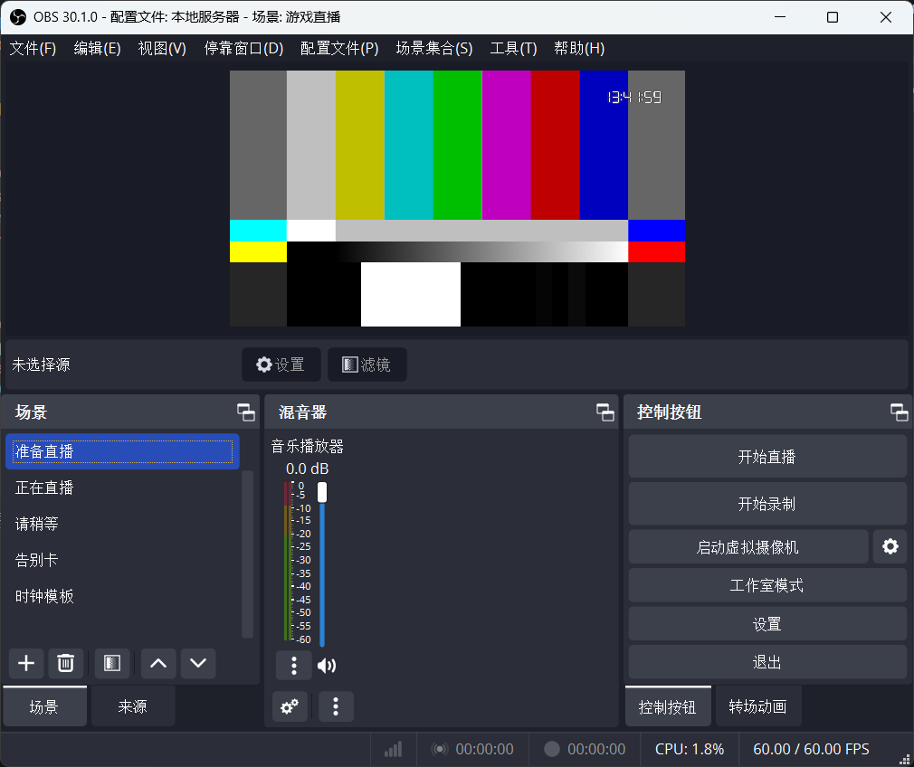

# OBS-LCD-Clock

## 简介

一个简单的 OBS 报时器插件，使用 [DESG](https://github.com/keshikan/DSEG) 字体项目制作。

## 使用方法

1. 克隆本仓库。
2. 在 OBS 创建一个名为 “时钟模板” 的场景。
3. 新增一个浏览器来源，勾选本地文件，选择已克隆仓库的文件位置，选择 HTML 文件。
4. 在 OBS 的来源点击 + 号，点击场景，选择 “时钟模板” ，移动至第一层。

| 名称 | URI | 字体 |
| ---- | ---- | ---- |
| 实时时钟 | index.html | DSEG7Classic-Regular |
| 30分钟显示时钟 | 30m.html | DSEG7Classic-Regular |
| 30分钟显示时钟（淡入淡出动画）| 30ma.html | DSEG7Classic-Regular |
| 实时时钟 | Bold/index.html | DSEG7Classic-Bold |
| 30分钟显示时钟 | Bold/30m.html | DSEG7Classic-Bold |
| 30分钟显示时钟（淡入淡出动画）| Bold/30ma.html | DSEG7Classic-Bold |

## 鸣谢
[CodeGeeX](https://codegeex.cn)
[Ollama](https://ollama.com)